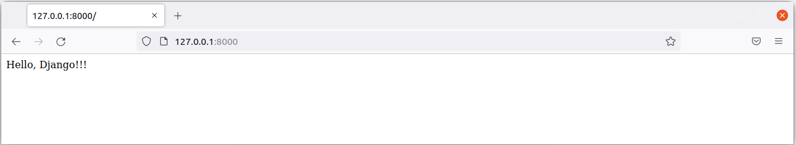

# Providing a container for your project 

> We're about having the following structure:
  
UML IMAGE HERE... IS COMING...

####
## 1. Get starts by typing `ctrl+alt+t` to call the bash terminal, then follow down to the next commands...

## ` $ cd Desktop/ `
<span style='color:#fff; font-family: Dejavu Sans Mono; font-size: 1.1em;'>- Path: /home/marcosranes/Desktop</span>

## ` $ git init Hello_Django `
```
hint: Using 'master' as the name for the initial branch. This default branch name
hint: is subject to change. To configure the initial branch name to use in all
hint: of your new repositories, which will suppress this warning, call:
hint: 
hint: 	git config --global init.defaultBranch <name>
hint: 
hint: Names commonly chosen instead of 'master' are 'main', 'trunk' and
hint: 'development'. The just-created branch can be renamed via this command:
hint: 
hint: 	git branch -m <name>
Initialized empty Git repository in /home/marcosranes/Desktop/Hello_Django/.git/
```

## ` $ cd Hello_Django/ `
<span style='color:#fff; font-family: Dejavu Sans Mono; font-size: 1.1em;'>- Path: /home/marcosranes/Desktop/Hello_Django</span>
### ` $ ls -a `
```
.
..
.git
```
Also, Git left a couple of tips for us, so let's take care of them before getting initialized with the new features over the branch.

` $ git status | grep ma `
```
On branch master
```
` $ git branch -m main `

` $ git status | grep ma `
```
On branch main
```
####
## 2. Now, let's proceed to create a virtual environment...
## ` $ pipenv install `
```
Creating a virtualenv for this project...
Pipfile: /home/marcosranes/Desktop/Hello_Django/Pipfile
Using /home/marcosranes/.pyenv/versions/3.9.7/bin/python3.9 (3.9.7) to create virtualenv...
⠹ Creating virtual environment...created virtual environment CPython3.9.7.final.0-64 in 105ms
  creator CPython3Posix(dest=/home/marcosranes/Desktop/Hello_Django/.venv, clear=False, no_vcs_ignore=False, global=False)
  seeder FromAppData(download=False, pip=bundle, setuptools=bundle, wheel=bundle, via=copy, app_data_dir=/home/marcosranes/.local/share/virtualenv)
    added seed packages: pip==21.2.4, setuptools==58.1.0, wheel==0.37.0
  activators BashActivator,CShellActivator,FishActivator,NushellActivator,PowerShellActivator,PythonActivator

✔ Successfully created virtual environment! 
Virtualenv location: /home/marcosranes/Desktop/Hello_Django/.venv
Creating a Pipfile for this project...
Pipfile.lock not found, creating...
Locking [dev-packages] dependencies...
Locking [packages] dependencies...
Updated Pipfile.lock (16c839)!
Installing dependencies from Pipfile.lock (16c839)...
  🐍   ▉▉▉▉▉▉▉▉▉▉▉▉▉▉▉▉▉▉▉▉▉▉▉▉▉▉▉▉▉▉▉▉ 0/0 — 00:00:00
To activate this project's virtualenv, run pipenv shell.
Alternatively, run a command inside the virtualenv with pipenv run.
```

### ` $ ls -a `
<span style='color:#fff; font-family: Dejavu Sans Mono; font-size: 1.1em;'>- Path: /home/marcosranes/Desktop/Hello_Django</span>
```
.
..
.git
Pipfile
Pipfile.lock
.venv
```
### ` $ pipenv shell `
```shell
marcosranes@ubuntu21-vbox:~/Desktop/Hello_Django$ pipenv shell
Launching subshell in virtual environment...
marcosranes@ubuntu21-vbox:~/Desktop/Hello_Django$  . /home/marcosranes/Desktop/Hello_Django/.venv/bin/activate
(Hello_Django) marcosranes@ubuntu21-vbox:~/Desktop/Hello_Django$ 
```
####
## 3. Once having a virtual environment activated, let's get download and install our first dependency to our container...
## ` $ pipenv install django `
```shell
Installing django...
Adding django to Pipfile's [packages]...
✔ Installation Succeeded 
Pipfile.lock (16c839) out of date, updating to (06f36b)...
Locking [dev-packages] dependencies...
Locking [packages] dependencies...
Building requirements...
Resolving dependencies...
✔ Success! 
Updated Pipfile.lock (06f36b)!
Installing dependencies from Pipfile.lock (06f36b)...
  🐍   ▉▉▉▉▉▉▉▉▉▉▉▉▉▉▉▉▉▉▉▉▉▉▉▉▉▉▉▉▉▉▉▉ 0/0 — 00:00:00
```

```shell
Uninstalling django...
Found existing installation: Django 3.2.8
Uninstalling Django-3.2.8:
  Successfully uninstalled Django-3.2.8

Removing django from Pipfile...
Locking [dev-packages] dependencies...
Locking [packages] dependencies...
Updated Pipfile.lock (16c839)!
```
>### After that, let's get a view of what has been changed...
### ` $ pip freeze `
Earlier it was a void list, now we have the Django itself and three others dependencies coming up when Django was installed.
```shell
asgiref==3.4.1
Django==3.2.8
pytz==2021.3
sqlparse==0.4.2
```
### ` $ cat Pipfile `
As you can see `[packages]` section gains the first require assignment...
```shell
[[source]]
url = "https://pypi.org/simple"
verify_ssl = true
name = "pypi"

[packages]
django = "*"

[dev-packages]

[requires]
python_version = "3.9"
```
####
# Creating a *Django Project* onto the Hello_Django container
> <span style='color:#fff; font-family: Dejavu Sans Mono; font-size: 1.1em;'>- Path: /home/marcosranes/Desktop/Hello_Django</span>
## ` $ django-admin startproject Welcome `
After running this command, nothing outputs to you, so ensure that it has been successfully done.
### ` $ ls -a `
```
.
..
.git
.idea
Pipfile
Pipfile.lock
.venv
Welcome
```
### ` $ ls -a Welcome/ `
```
.
..
manage.py
Welcome
```
### ` $ tree Welcome `
```
Welcome
├── manage.py
└── Welcome
    ├── asgi.py
    ├── __init__.py
 -> ├── settings.py
 -> ├── urls.py
    └── wsgi.py

1 directory, 6 files
```
After claiming a Django project, look that it creates the `manage.py` management tool along with a homonym Python package with **.py** files within this package.\
From now on, **Welcome** package will take the control of the coming applications, and **manage.py** will handle on initializing them.\
At first, there are just two files you have to matter here: `settings.py` and `urls.py`.
### ` $ cat Welcome/manage.py `
```
#!/usr/bin/env python
"""Django's command-line utility for administrative tasks."""
import os
import sys


def main():
    """Run administrative tasks."""
    os.environ.setdefault('DJANGO_SETTINGS_MODULE', 'Welcome.settings')
    try:
        from django.core.management import execute_from_command_line
    except ImportError as exc:
        raise ImportError(
            "Couldn't import Django. Are you sure it's installed and "
            "available on your PYTHONPATH environment variable? Did you "
            "forget to activate a virtual environment?"
        ) from exc
    execute_from_command_line(sys.argv)


if __name__ == '__main__':
    main()
```
### ` $ cat Welcome/Welcome/settings.py `
```
"""
Django settings for Welcome project.

Generated by 'django-admin startproject' using Django 3.2.8.

For more information on this file, see
https://docs.djangoproject.com/en/3.2/topics/settings/

For the full list of settings and their values, see
https://docs.djangoproject.com/en/3.2/ref/settings/
"""

from pathlib import Path

# Build paths inside the project like this: BASE_DIR / 'subdir'.
BASE_DIR = Path(__file__).resolve().parent.parent


# Quick-start development settings - unsuitable for production
# See https://docs.djangoproject.com/en/3.2/howto/deployment/checklist/

# SECURITY WARNING: keep the secret key used in production secret!
SECRET_KEY = 'django-insecure-q4k&2duy8bf1@zlg8%=lemn#_p=z-$stk$th6o936qr1s#z!r='

# SECURITY WARNING: don't run with debug turned on in production!
DEBUG = True

ALLOWED_HOSTS = []


# Application definition

INSTALLED_APPS = [
    'django.contrib.admin',
    'django.contrib.auth',
    'django.contrib.contenttypes',
    'django.contrib.sessions',
    'django.contrib.messages',
    'django.contrib.staticfiles',
]

MIDDLEWARE = [
    'django.middleware.security.SecurityMiddleware',
    'django.contrib.sessions.middleware.SessionMiddleware',
    'django.middleware.common.CommonMiddleware',
    'django.middleware.csrf.CsrfViewMiddleware',
    'django.contrib.auth.middleware.AuthenticationMiddleware',
    'django.contrib.messages.middleware.MessageMiddleware',
    'django.middleware.clickjacking.XFrameOptionsMiddleware',
]

ROOT_URLCONF = 'Welcome.urls'

TEMPLATES = [
    {
        'BACKEND': 'django.template.backends.django.DjangoTemplates',
        'DIRS': [],
        'APP_DIRS': True,
        'OPTIONS': {
            'context_processors': [
                'django.template.context_processors.debug',
                'django.template.context_processors.request',
                'django.contrib.auth.context_processors.auth',
                'django.contrib.messages.context_processors.messages',
            ],
        },
    },
]

WSGI_APPLICATION = 'Welcome.wsgi.application'


# Database
# https://docs.djangoproject.com/en/3.2/ref/settings/#databases

DATABASES = {
    'default': {
        'ENGINE': 'django.db.backends.sqlite3',
        'NAME': BASE_DIR / 'db.sqlite3',
    }
}


# Password validation
# https://docs.djangoproject.com/en/3.2/ref/settings/#auth-password-validators

AUTH_PASSWORD_VALIDATORS = [
    {
        'NAME': 'django.contrib.auth.password_validation.UserAttributeSimilarityValidator',
    },
    {
        'NAME': 'django.contrib.auth.password_validation.MinimumLengthValidator',
    },
    {
        'NAME': 'django.contrib.auth.password_validation.CommonPasswordValidator',
    },
    {
        'NAME': 'django.contrib.auth.password_validation.NumericPasswordValidator',
    },
]


# Internationalization
# https://docs.djangoproject.com/en/3.2/topics/i18n/

LANGUAGE_CODE = 'en-us'

TIME_ZONE = 'UTC'

USE_I18N = True

USE_L10N = True

USE_TZ = True


# Static files (CSS, JavaScript, Images)
# https://docs.djangoproject.com/en/3.2/howto/static-files/

STATIC_URL = '/static/'

# Default primary key field type
# https://docs.djangoproject.com/en/3.2/ref/settings/#default-auto-field

DEFAULT_AUTO_FIELD = 'django.db.models.BigAutoField'
```

### ` $ cat Welcome/Welcome/urls.py `
```
"""Welcome URL Configuration

The `urlpatterns` list routes URLs to views. For more information please see:
    https://docs.djangoproject.com/en/3.2/topics/http/urls/
Examples:
Function views
    1. Add an import:  from my_app import views
    2. Add a URL to urlpatterns:  path('', views.home, name='home')
Class-based views
    1. Add an import:  from other_app.views import Home
    2. Add a URL to urlpatterns:  path('', Home.as_view(), name='home')
Including another URLconf
    1. Import the include() function: from django.urls import include, path
    2. Add a URL to urlpatterns:  path('blog/', include('blog.urls'))
"""
from django.contrib import admin
from django.urls import path

urlpatterns = [
    path('admin/', admin.site.urls),
]
```
## ` $ python Welcome/manage.py runserver `
```shell
Watching for file changes with StatReloader
Performing system checks...

System check identified no issues (0 silenced).

You have 18 unapplied migration(s). Your project may not work properly until you apply the migrations for app(s): admin, auth, contenttypes, sessions.
Run 'python manage.py migrate' to apply them.
October 19, 2021 - 18:52:20
Django version 3.2.8, using settings 'Welcome.settings'
Starting development server at http://127.0.0.1:8000/
Quit the server with CONTROL-C.
```
So, in order for us to call the server out, we need the **manage.py** file, that in turn is a **.py** dependency file
living within the project Welcome. So, you know how to run **.py** files, don't you? --**python** needs to be explicit before.
### `$ python manage.py runserver`
###
Just a **hint:** Don't get confused!!!\
As earlier told here, when running `$ django-admin startproject <Project's_Name>`, it
creates a directory; within that directory, a __manage.py__ file and a **Python package** with the __same name.__\
Also, a package is a directory too, and what turns that directory into a Python package is the presence of the `__init__.py` Python file.

So, what we're about of seeing, is a valid command for creating a Python package from a terminal.
```text
(Hello_Django) marcosranes@ubuntu21-vbox:~/Desktop/Container$ mkdir Project && cd Project
(Hello_Django) marcosranes@ubuntu21-vbox:~/Desktop/Container/Project$ mkdir Project && cd Project
(Hello_Django) marcosranes@ubuntu21-vbox:~/Desktop/Container/Project/Project$ touch __init__.py
(Hello_Django) marcosranes@ubuntu21-vbox:~/Desktop/Container/Project/Project$ cd ../../..
(Hello_Django) marcosranes@ubuntu21-vbox:~/Desktop$ tree Container
Container
└── Project
    └── Project
        └── __init__.py

2 directories, 1 file
(Hello_Django) marcosranes@ubuntu21-vbox:~/Desktop$ 
```
And, below... for a better understanding, it's just a simple simulation of what the command `django-admin startproject Project` does.
```
(Hello_Django) marcosranes@ubuntu21-vbox:~/Desktop/Container$ mkdir Project && cd Project
(Hello_Django) marcosranes@ubuntu21-vbox:~/Desktop/Container/Project$ touch manage.py
(Hello_Django) marcosranes@ubuntu21-vbox:~/Desktop/Container/Project$ mkdir Project && cd Project
(Hello_Django) marcosranes@ubuntu21-vbox:~/Desktop/Container/Project/Project$ touch asgi.py __init__.py settings.py urls.py wsgi.py
(Hello_Django) marcosranes@ubuntu21-vbox:~/Desktop/Container/Project/Project$ tree ../../../Container/
../../../Container/
└── Project
    ├── manage.py
    └── Project
        ├── asgi.py
        ├── __init__.py
        ├── settings.py
        ├── urls.py
        └── wsgi.py

2 directories, 6 files
(Hello_Django) marcosranes@ubuntu21-vbox:~/Desktop/Container/Project/Project$ 
```
####
# Now, we're going to provide a *Django Application* to the project Welcome...
# ` $ cd Welcome/ `
<span style='color:#fff; font-family: Dejavu Sans Mono; font-size: 1.1em;'>- Path: /home/marcosranes/Desktop/Hello_Django/Welcome</span>

When within the **project** folder, you can explore it to see how things are.
### ` $ ls -a `
```
.
..
manage.py
Welcome
```
### ` $ tree ../Welcome `
```
../Welcome
├── manage.py
└── Welcome
    ├── asgi.py
    ├── __init__.py
    ├── settings.py
    ├── urls.py
    └── wsgi.py

1 directories, 6 files
```

# ` $ python manage.py startapp greet `
That command will provide us with an application for our project Welcome, named **greet**.\
After running that command, no outputs to us.
So, let's go around for exploring that structure in more detail:

### ` $ pwd `
```
/home/marcosranes/Desktop/Hello_Django/Welcome
```

### ` $ ls -a `
```
.
..
db.sqlite3
greet
manage.py
Welcome
```
As you can see, that command brought to the project two more features: an application named **greet**, and a **database** config file.
### ` $ tree ../Welcome `
```
../Welcome
├── db.sqlite3
├── greet
│   ├── admin.py
│   ├── apps.py
│   ├── __init__.py
│   ├── migrations
│   │   └── __init__.py
│   ├── models.py
│   ├── tests.py
│   └── views.py
├── manage.py
└── Welcome
    ├── asgi.py
    ├── __init__.py
    ├── settings.py
    ├── urls.py
    └── wsgi.py

3 directories, 14 files
```

## ` $ ls -a greet/ `
```
.
..
admin.py
apps.py
__init__.py
migrations
models.py
tests.py
views.py
```
Once into the folder greet we get notice a __init__.py file, that turns a folder into a package. We have migrations that 
will deal with a database. But for our "Hello, Django", we'll just need three things: apps.py, views.py, and a file urls.py
that we have to create and add it here.
### ` $ cat greet/apps.py `
```
from django.apps import AppConfig


class GreetConfig(AppConfig):
    default_auto_field = 'django.db.models.BigAutoField'
    name = 'greet'
```

### ` $ cat greet/views.py `
```
from django.shortcuts import render

# Create your views here.
```
####
## That's all set. Now, let's continue in the Pycharm IDE...
By the time we run the command `python manage.py startapp <app_name>`, we're creating an application for your project Welcome,
which has to be added onto settings.py file in the section INSTALLED_APPS. We can see these settings in the file apps.py which
will be placed to setting.py, and it should respect the syntax: `app_name.file_name.class_name`.

### ` $ cat greet/apps.py | grep name `
```
name = 'greet'
```

### ` $ cat greet/apps.py | grep class `
```
class GreetConfig(AppConfig):
```
With these values we can easily deduct that app_name=`greet`.file_name=`apps`.class_name=`GreetConfig`

But, a good practice is opening both apps.py and settings.py side by side in the Pycharm to make these changes.
### ` $ cat Welcome/settings.py `
```
...
# SECURITY WARNING: don't run with debug turned on in production!
DEBUG = True

ALLOWED_HOSTS = []


# Application definition

INSTALLED_APPS = [
    'django.contrib.admin',
    'django.contrib.auth',
    'django.contrib.contenttypes',
    'django.contrib.sessions',
    'django.contrib.messages',
    'django.contrib.staticfiles',
    'greet.apps.GreetConfig',
]

MIDDLEWARE = [
    'django.middleware.security.SecurityMiddleware',
    'django.contrib.sessions.middleware.SessionMiddleware',
...
```
More nothing to do, so you can close these two files.


### ` $ cat greet/views.py `
```
from django.shortcuts import render

# Create your views here.
from django.http import HttpResponse


def hello(request):
    greet1 = 'Hello, Django!!!'
    return HttpResponse(greet1)
```
Making changes to your view. It should seem like this.

Now, let's make changes to urls...

### ` $ cat Welcome/urls.py `
```
"""Welcome URL Configuration

The `urlpatterns` list routes URLs to views. For more information please see:
    https://docs.djangoproject.com/en/3.2/topics/http/urls/
Examples:
Function views
    1. Add an import:  from my_app import views
    2. Add a URL to urlpatterns:  path('', views.home, name='home')
Class-based views
    1. Add an import:  from other_app.views import Home
    2. Add a URL to urlpatterns:  path('', Home.as_view(), name='home')
Including another URLconf
    1. Import the include() function: from django.urls import include, path
    2. Add a URL to urlpatterns:  path('blog/', include('blog.urls'))
"""
from django.contrib import admin
from django.urls import path

urlpatterns = [
    path('admin/', admin.site.urls),
]
```

### ` $ cat Welcome/urls.py `
```
"""Welcome URL Configuration

The `urlpatterns` list routes URLs to views. For more information please see:
    https://docs.djangoproject.com/en/3.2/topics/http/urls/
Examples:
Function views
    1. Add an import:  from my_app import views
    2. Add a URL to urlpatterns:  path('', views.home, name='home')
Class-based views
    1. Add an import:  from other_app.views import Home
    2. Add a URL to urlpatterns:  path('', Home.as_view(), name='home')
Including another URLconf
    1. Import the include() function: from django.urls import include, path
    2. Add a URL to urlpatterns:  path('blog/', include('blog.urls'))
"""
from django.contrib import admin
from django.urls import path, include

urlpatterns = [
    path('admin/', admin.site.urls),
    path('', include('greet.urls')),
]
```

### ` touch greet/urls.py `
```shell
(Hello_Django) marcosranes@ubuntu21-vbox:~/Desktop/Hello_Django/Welcome$ echo "
> from django.urls import path
> from . import views
> 
> 
> urlpatterns = [
>     path('', views.hello, name='hello'),
> ]" >> greet/urls.py
```
```
(Hello_Django) marcosranes@ubuntu21-vbox:~/Desktop/Hello_Django/Welcome$ python manage.py runserver 
Watching for file changes with StatReloader
Performing system checks...

System check identified no issues (0 silenced).

You have 18 unapplied migration(s). Your project may not work properly until you apply the migrations for app(s): admin, auth, contenttypes, sessions.
Run 'python manage.py migrate' to apply them.
October 20, 2021 - 06:07:09
Django version 3.2.8, using settings 'Welcome.settings'
Starting development server at http://127.0.0.1:8000/
Quit the server with CONTROL-C.
```
